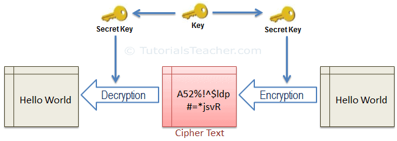

# Some Terminologies

## CVE

**CVE**, short for Common Vulnerabilities and Exposures, is a list of publicly disclosed computer security flaws. When someone refers to a CVE, they mean a security flaw that's been assigned a CVE ID number.

## Hardening

**Hardening** is a process that prevents possible cyber attacks on servers, such as AMI.

Security group rules: A security rule applies either to inbound traffic (**ingress**) or outbound traffic (**egress**). 

## SSL 

`SSH tunneling` is a method of transporting arbitrary networking data over an encrypted SSH connection.

**SSL** stands for Secure Socket Layer.

The client contacts the server and sends the first message. The first message causes the client and server to exchange a few messages to negotiate the encryption algorithm to use and to pick an encryption key to use for this connection. Then the client's data is sent to the server. After this is done the client and the server can exchange information at will.

An asymmetric cryptography:


A symmetric cryptography:



An SSL handshake:

1. Hello messages contain SSL version number, cipher settings, session-specific data, etc. (browser receives the certificate served as a **public key**)
2. The client verifies the server's SSL certificate from **CA (Certificate Authority)** and authenticates the server (CA uses **private key** to perform verification)
3. The client creates a session key, encrypts it with the server's public key and sends it to the server
4. The server decrypts the session key with its private key and sends the acknowledgement


After a successful handshake, data is transferred with session key encryption.


**OAuth** is an open standard for authorization, commonly used as a way for Internet users to log in to third party websites using their Microsoft, Google, Facebook, Twitter, One Network etc. accounts without exposing their password.


## LDAP

**LDAP** (lightweight directory access protocol) is a communication protocol that defines the methods in which a directory service can be accessed.

Entries are all added to an LDAP system as branches on trees called **Data Information Trees**, or DITs.

```
dn: cn=John Doe, ou=people, dc=example,dc=com
objectclass: person
cn: John Doe
givenName: Doe
sn: Doe
telephoneNumber: +1 888 555 6789
telephoneNumber: +1 888 555 1232
mail: john@example.com
manager: cn=Barbara Doe,dc=example,dc=com
objectClass: inetOrgPerson
objectClass: organizationalPerson
objectClass: person
objectClass: top
```

Given the example below, (`dn` for Distinguished Name) `sn=Doe` is an entry. The direct parent is an entry called `ou=people` which is probably being used as a container for entries describing people. The parents of this entry derived from the `example.com` domain name, which functions as the root of our DIT.

`ObjectClass` attribute specifies the object classes of an entry, which (among other things) are used in conjunction with the controlling schema to determine the permitted attributes of an entry.

Here below is an example of `ObjectClass` definition.
```
( 2.5.6.6 NAME 'people' SUP top STRUCTURAL MUST ( sn $ cn $ ou) MAY ( userPassword $ telephoneNumber $ seeAlso $ description ) )
```
This indicates that the people object class is a structural class with `OID 2.5.6.6`. Entries with the people object class are required to include the `sn` (surname), `ou` (organizational unit) and `cn` (common name) attribute types, and may also include any or all of the userPassword, telephoneNumber, seeAlso, and description attribute types. And because the people object class inherits from the `top` object class, entries containing the people object class are required to also include the objectClass attribute type (which is declared as mandatory in the top object class). The people object class is not obsolete and does not have a description.